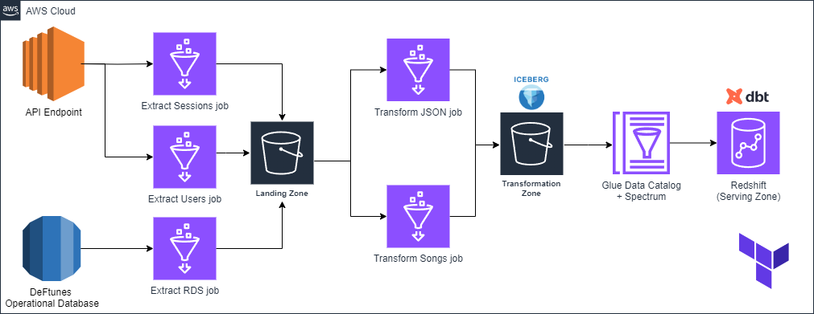

# DeFtunes Data Pipeline - Data Engineering Capstone Project

## Project Overview
This project implements a robust data pipeline for DeFtunes, a music streaming service that has expanded to include digital song purchases. The pipeline extracts data from multiple sources, transforms it using AWS Glue, and loads it into a data warehouse for analysis. The architecture incorporates data quality checks and orchestration to improve robustness.

## Business Context
DeFtunes requires a comprehensive data pipeline to:
- Extract purchase data from their API and operational database
- Enrich and model this data for analysis
- Enable the Data Analysis team to derive insights from customer purchases
- Support incremental ingestion of new data
- Ensure data quality through automated checks
- Provide analytical views for business intelligence

## Technologies Used
- **AWS Glue**: ETL service for data extraction and transformation
- **AWS S3**: Data storage for landing and transformation zones
- **Apache Iceberg**: Table format for the data lake
- **AWS Redshift**: Data warehouse for analytical queries
- **dbt (data build tool)**: Data transformation and modeling
- **Apache Airflow**: Workflow orchestration
- **AWS Glue Data Quality**: Data quality validation
- **Apache Superset**: Data visualization
- **Terraform**: Infrastructure as Code

## Architecture Components

### 1. Data Sources
- **DeFtunes API**: Provides user and session data through REST endpoints
- **DeFtunes Operational RDS**: Contains song information in PostgreSQL

### 2. Data Ingestion
- Three AWS Glue jobs extract data from sources to the landing zone
- Incremental loading with date-based parameters

### 3. Data Transformation
- AWS Glue jobs transform raw data into Apache Iceberg tables
- Data cleansing and enrichment

### 4. Data Quality
- AWS Glue Data Quality ensures data integrity with rule-based validation
- Quality checks on users, sessions, and songs data

### 5. Data Modeling
- Star schema implementation using dbt
- Fact table: fact_session
- Dimension tables: dim_users, dim_songs, dim_artists

### 6. Analytics Layer
- Materialized views for business intelligence
- Key views:
  - Sales per artist
  - Sales per country

### 7. Orchestration
- Apache Airflow DAGs schedule and monitor pipeline execution
- Two main workflows:
  - Songs data pipeline
  - API (users and sessions) data pipeline

## Pipeline Workflow

### Songs Data Pipeline
1. Extract songs data from RDS
2. Transform songs data to Iceberg format
3. Perform data quality checks
4. Build dimensional model with dbt

### API Data Pipeline
1. Extract users and sessions data from API endpoints
2. Transform JSON data to Iceberg format
3. Perform data quality checks on users and sessions
4. Build dimensional model with dbt

## Implementation Details

### Data Quality
Rule-based validation includes:
- Completeness checks (e.g., IsComplete "user_id")
- Column length validation (e.g., ColumnLength "user_id" = 36)
- Value range checks (e.g., ColumnValues "price" <= 2)
- Uniqueness constraints (e.g., Uniqueness "user_id" > 0.95)

### Analytical Views
- **sales_per_artist_vw**: Aggregates sales by year and artist
- **sales_per_country_vw**: Aggregates sales by month, year, and country

### Orchestration
- Monthly scheduled data extraction
- Dependencies between tasks ensure data integrity
- Error handling and monitoring

## Getting Started

### Prerequisites
- AWS account with necessary permissions
- Terraform installed
- Access to AWS console

### Deployment Steps
1. Configure AWS credentials
2. Update Terraform variables
3. Run setup script: `source scripts/setup.sh`
4. Deploy infrastructure: `terraform apply`
5. Verify successful deployment through AWS console

## Future Enhancements
- Real-time data processing with Kinesis
- Machine learning integration for recommendation engine
- Enhanced dashboard with customer behavior analytics
- Automated testing framework

## Conclusion
This data pipeline provides DeFtunes with a scalable, maintainable solution for analyzing their digital sales data. By implementing data quality checks and orchestration, the pipeline ensures reliable data for business intelligence and decision-making.
